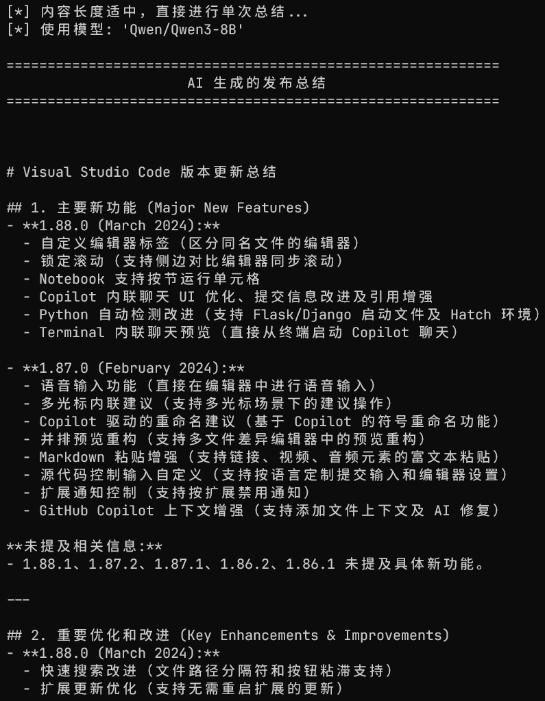

# GitHub Release Summarizer

一个命令行工具，用于获取 GitHub 仓库的 Release Notes，并利用 AI 模型生成结构清晰、内容简洁的变更总结。



## ✨ 功能特性

- **获取 Release Notes**: 从任何公开或私有的 GitHub 仓库中抓取所有发布说明。
- **版本过滤**: 轻松按版本范围（例如，从起始版本、到结束版本，或在特定区间内）筛选 Release。
- **AI 驱动的总结**: 自动生成结构化的变更总结，内容分类为新功能、优化改进、Bug 修复和重大变更。
- **智能长文本处理 (Map-Reduce)**: 当 Release Notes 总长度超过预设阈值时，工具会自动将内容分割成小块，先对每个块进行独立总结（Map），然后将这些部分摘要整合起来生成一份最终的、全面的报告（Reduce）。这确保了在处理超长上下文时信息的完整性和总结质量。
- **灵活的 AI 服务支持**: 兼容任何与 OpenAI API 规范一致的接口，让您可以使用 Gemini、Claude、DeepSeek、豆包或本地模型等多种 AI 服务。
- **高度可配置**: 支持通过环境变量和命令行参数进行灵活配置。

## 🚀 安装与配置

### 1. 安装依赖

首先，克隆本仓库到您的本地机器：

```bash
git clone https://github.com/shenshan-des/github-release-summarizer.git
cd github-release-summarizer
```

然后，使用 `requirements.txt` 文件安装所需的 Python 依赖。

```bash
pip install -r requirements.txt
```

### 2. 设置环境变量

脚本优先使用环境变量进行配置，这是推荐的做法。当然，您也可以在运行时通过命令行参数传入。

#### **`GITHUB_TOKEN` (必需)**

与 GitHub API 交互需要个人访问令牌 (Personal Access Token)。这能确保您可以访问私有仓库，并避免在访问公开仓库时被 API 速率限制。

- 您可以在这里创建 Token: [https://github.com/settings/tokens](https://github.com/settings/tokens)

#### **AI 相关配置 (使用 `--summarize` 功能时需要)**

仅当您使用 `--summarize` 标志时，才需要配置这些变量。

- **`OPENAI_API_KEY`**: 您的 AI 服务 API 密钥。
- **`OPENAI_API_BASE`**: API 的基础 URL。这允许您使用 OpenAI 以外的服务。
- **`OPENAI_MODEL_NAME`**: 要使用的模型名称。如果未设置，脚本将默认使用 `gpt-4o-mini`。

#### **高级配置 (可选)**

- **`MAX_CHARS_FOR_SINGLE_CALL`**: 触发分块总结的字符数阈值。默认值为 `15000`。如果您的模型支持更长的上下文，可以适当调高此值以减少分块次数。

**设置变量的方法:**

**macOS / Linux**:

```bash
export GITHUB_TOKEN="ghp_YourGitHubTokenHere"
export OPENAI_API_KEY="Your_API_Key"
export OPENAI_API_BASE="https://api.openai.com/v1" # 或您的自定义接口地址
export OPENAI_MODEL_NAME="gpt-4-turbo"
```

**Windows (CMD)**:

```bash
set GITHUB_TOKEN="ghp_YourGitHubTokenHere"
set OPENAI_API_KEY="Your_API_Key"
set OPENAI_API_BASE="https://api.openai.com/v1"
set OPENAI_MODEL_NAME="gpt-4-turbo"
```

**Windows (PowerShell)**:

```bash
$env:GITHUB_TOKEN="ghp_YourGitHubTokenHere"
$env:OPENAI_API_KEY="Your_API_Key"
$env:OPENAI_API_BASE="https://api.openai.com/v1"
$env:OPENAI_MODEL_NAME="gpt-4-turbo"
```

## 📖 使用说明

### 命令行参数

| 参数 | 对应环境变量 | 描述 |
|---|---|---|
| `repo` | - | **必需**。目标仓库，格式为 `owner/repo`。 |
| `--start` | - | 起始版本号 (包含此版本)。 |
| `--end` | - | 结束版本号 (包含此版本)。 |
| `--token` | `GITHUB_TOKEN` | 您的 GitHub 个人访问令牌。 |
| `--summarize` | - | 启用 AI 总结功能的标志。 |
| `--ai-api-key` | `OPENAI_API_KEY` | AI 服务的 API 密钥。 |
| `--ai-api-base`| `OPENAI_API_BASE` | AI 服务的 Base URL。 |
| `--model` | `OPENAI_MODEL_NAME`| 要使用的 AI 模型 (默认: `gpt-4o-mini`)。 |

### 使用示例

#### 基本用法 (仅获取原始 Release Notes)

1.  **获取一个仓库的所有 Release**:
    ```bash
    python main.py microsoft/vscode
    ```

2.  **获取自 1.80.0 版本以来的所有新 Release**:
    ```bash
    python main.py microsoft/vscode --start 1.80.0
    ```

3.  **获取指定版本区间内的 Release**:
    ```bash
    python main.py microsoft/vscode --start 1.82.0 --end 1.85.1
    ```

4.  **通过命令行直接传入 Token**:
    ```bash
    python main.py microsoft/vscode --start 1.90.0 --token ghp_YourTokenHere...
    ```

#### AI 总结用法

1.  **获取自 1.88.0 版本以来所有新 Release 的总结**:
    *(此示例假设您已设置好 AI 相关的环境变量)*
    ```bash
    python main.py microsoft/vscode --start 1.88.0 --summarize
    ```

2.  **为特定范围的 Release 生成总结，并指定模型**:
    ```bash
    python main.py vuejs/core --start v3.4.0 --end v3.4.21 --summarize --model gpt-4-turbo
    ```

3.  **通过命令行提供所有 AI 参数 (使用自定义服务)**:
    ```bash
    python main.py tailwindlabs/tailwindcss --start v3.4.0 --summarize --ai-api-key "sk-..." --ai-api-base "https://api.groq.com/openai/v1" --model "llama3-70b-8192"
